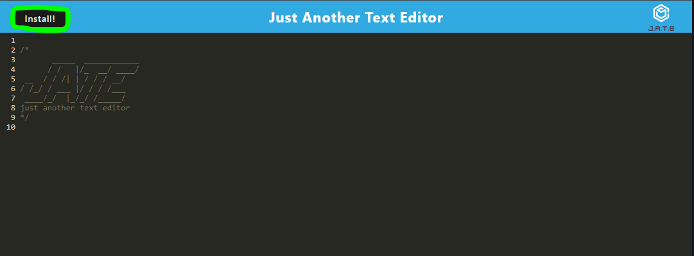

# PWA-Text-Editor

## Description
Single page text editor application that meets PWA criteria. 
## Table of Contents 

- [Installation](#installation)
- [Usage](#usage)
- [Credits](#credits)
- [License](#license)

## Installation

You can access this project by clicking the following link: 

From here you can use the Install button at the top left of the window, or continue using the app on your web browser.

## Usage
Type notes you would like to keep track of on the text editor's lines. 

## Credits

[Coding Bootcamp](https://courses.bootcampspot.com)

[Professor Phil Loy](https://github.com/philliploy)

## License

This project is licensed under the [MIT License](LICENSE).

